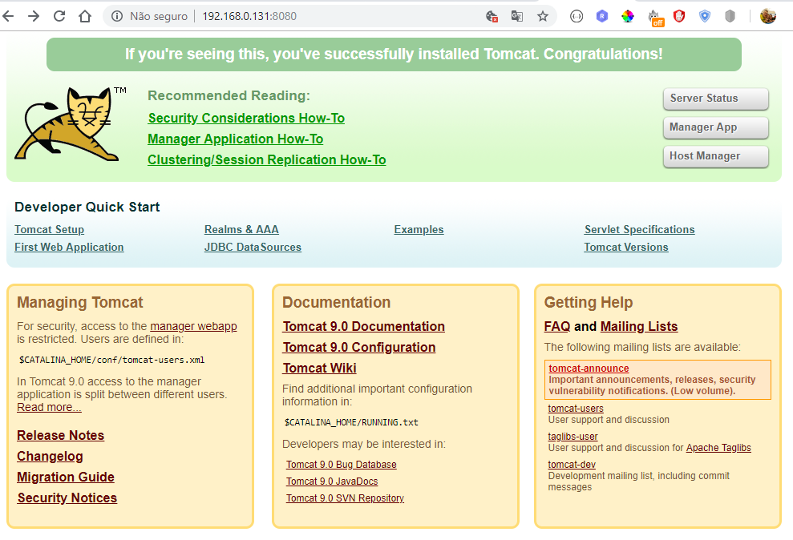
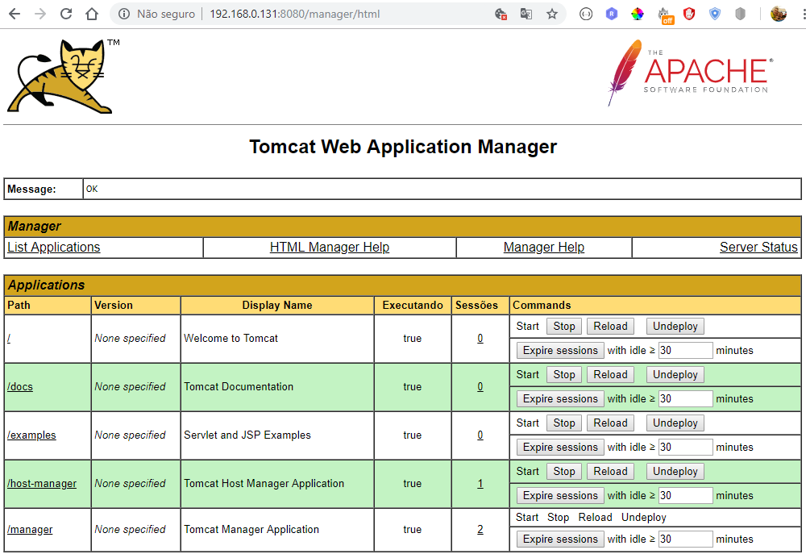
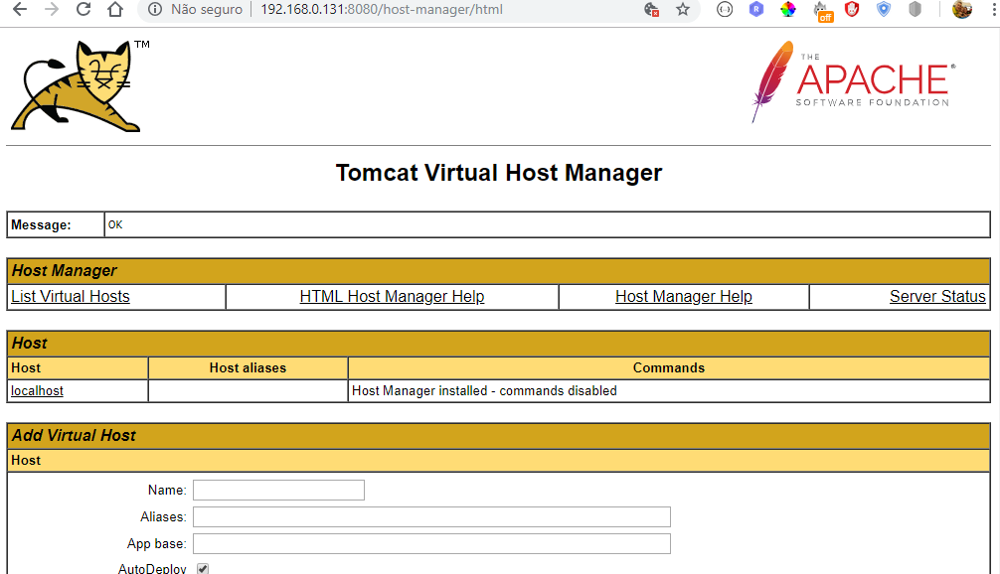

# Instalar o Apache Tomcat 9 no OEL 7+

## Introdução

O Apache Tomcat é um servidor da web e contêiner de servlet usado para servir aplicativos Java. O Tomcat é uma implementação de software livre das tecnologias Java Servlet e JavaServer Pages, lançada pela Apache Software Foundation. Este tutorial cobre a instalação básica e algumas configurações da versão mais recente do **Tomcat 9** no seu servidor **Oracle Enterprise Linux 7.3+**.

### Ajustando os repositórios do Linux

```bash
# baixar a versao mais recente do repositorio do oracel
# wget http://public-yum.oracle.com/public-yum-ol7.repo
# renomear o repositorio existente
cp /etc/yum.repos.d/public-yum-ol7.repo /root/public-yum-ol7-old.repo
# copiar o repositorio baixado no diretorio correto
curl http://public-yum.oracle.com/public-yum-ol7.repo > /etc/yum.repos.d/public-yum-ol7.repo

#habilitando repos
sudo yum-config-manager --enable ol7_addons
sudo yum-config-manager --enable ol7_UEKR4
sudo yum-config-manager --enable ol7_MySQL57
sudo yum-config-manager --enable ol7_optional_latest

sudo yum-config-manager --enable ol7_developer_EPEL
sudo yum-config-manager --save --setopt=ol7_developer_EPEL.skip_if_unavailable=true
# instalando EPEL (pacotes extras para o Enterprise Linux)
sudo yum -y install https://dl.fedoraproject.org/pub/epel/epel-release-latest-7.noarch.rpm
```

## Instalar o JAVA , versão mais recente. (ver.: 11.0.2)

O Tomcat requer que o Java esteja instalado no servidor, portanto, qualquer código de aplicativo da Web Java pode ser executado. Vamos satisfazer esse requisito instalando o OpenJDK 11.

```bash
# Autor: 1T(T) Anders
JAVA_VERSION=11.0.2
JAVA_VERSION_MAJOR=11
JAVA_HOME=/usr/local/jdk-${JAVA_VERSION}
environment_file="/etc/environment"
bash_profile_root_file="/root/.bash_profile"
bash_profile_file="/home/admin/.bash_profile"

rm -rf ${JAVA_HOME}
mkdir -p ${JAVA_HOME}
wget -nv https://download.java.net/java/GA/jdk${JAVA_VERSION_MAJOR}/9/GPL/openjdk-${JAVA_VERSION}_linux-x64_bin.tar.gz -O - | tar -zvxf - --strip=1 -C ${JAVA_HOME}
	
alternatives --install /usr/bin/java java ${JAVA_HOME}/bin/java 1
alternatives --install /usr/bin/javac javac ${JAVA_HOME}/bin/javac 1

export JAVA_HOME=${JAVA_HOME}
export PATH=$PATH:$JAVA_HOME/bin

#Habilita environment_file
cat << EOF >> ${environment_file}
# anders	
JAVA_HOME=${JAVA_HOME}
PATH=$PATH:$JAVA_HOME/bin
EOF

cat << EOF >> ${bash_profile_root_file}
# anders	
JAVA_HOME=${JAVA_HOME}
export JAVA_HOME
PATH=$PATH:$JAVA_HOME/bin
export PATH
EOF

cat << EOF >> ${bash_profile_file}
# anders	
JAVA_HOME=${JAVA_HOME}
export JAVA_HOME
PATH=$PATH:$JAVA_HOME/bin
export PATH
EOF

source ${environment_file}

java -version
javac -version
```

## Para o JAVA 8 , proceda da seguinte maneira

```bash
# para verificar qual jdk está instalado
rpm -aq | grep -i jdk
# remover a versao anterior do java
sudo yum -y remove java-1.8.0-openjdk-1.8.0.131-11.b12.el7.x86_64
sudo yum -y remove java-1.8.0-openjdk-headless-1.8.0.131-11.b12.el7.x86_64
# instalar a versao mais recente do java 8
sudo yum -y install java-1.8.0-openjdk-devel
#setar a variável de ambiente permanente
sudo vim /home/$USER/.bashrc
# add as variaveis no final do arquivo
export JAVA_HOME=/usr/lib/jvm/java-1.8.0-openjdk-1.8.0.201.b09-2.el7_6.x86_64
export JRE_HOME=${JAVA_HOME}/jre
export PATH=$PATH:${JAVA_HOME}/bin:${JRE_HOME}/bin

source /home/$USER/.bashrc
java -version
javac -version
```


## Etapa 1: Crie um usuário do Tomcat

Por motivos de segurança, o Tomcat deve ser executado como um usuário não privilegiado (ou seja, não é root). Vamos criar um novo usuário e grupo que irá executar o serviço Tomcat.

Primeiro, crie um novo grupo `tomcat`:

```bash
sudo groupadd tomcat
```

Em seguida, crie um novo usuário `tomcat`. Tornaremos esse usuário um membro do grupo `tomcat`, com um diretório inicial `/var/opt/tomcat`(onde instalaremos o Tomcat) e com um shell de `/bin/false`(para que ninguém possa fazer login na conta):

```bash
sudo useradd -M -s /bin/nologin -g tomcat -d /var/opt/tomcat tomcat
```

## Etapa 2: Instalar o Tomcat

A maneira mais fácil de instalar o Tomcat 9 neste momento é fazer o download do release binário mais recente e configurá-lo manualmente.

### Faça o download do Tomcat Binary

Encontre a versão mais recente do Tomcat 8 na página [Tomcat 9 Downloads](http://tomcat.apache.org/download-90.cgi) . No momento da escrita, a última versão é **9.0.16** . Na seção **Distribuições binárias** , na lista **Núcleo** , copie o link para "tar.gz".

Vamos baixar a última distribuição binária para o nosso diretório home usando `wget`.

Primeiro, instale `wget`usando o `yum`gerenciador de pacotes:

```bash
sudo yum -y install wget
```

Agora basta seguir os procedimento abaixo:

```bash
TOMCAT_VERSION_MAJOR=9
TOMCAT_VERSION_FULL=9.0.16
	
DIR_USER_TOMCAT=/var/opt/tomcat
CATALINA_HOME=${DIR_USER_TOMCAT}/latest
CATALINA_BASE=${CATALINA_HOME}
CATALINA_PID=${CATALINA_HOME}/temp
# pega da var ambiente do java
JAVA_HOME=${JAVA_HOME}
	
# criado na etapa acima
# criando usuario no dirtorio /opt/tomcat/latest
#sudo useradd -m -U -d ${DIR_USER_TOMCAT} -s /bin/false tomcat

sudo mkdir -p /var/opt/tomcat
# baixar pacote
curl -LO https://archive.apache.org/dist/tomcat/tomcat-${TOMCAT_VERSION_MAJOR}/v${TOMCAT_VERSION_FULL}/bin/apache-tomcat-${TOMCAT_VERSION_FULL}.tar.gz
#descompactar no diretori user tomcat
gunzip -c apache-tomcat-${TOMCAT_VERSION_FULL}.tar.gz | tar -xf - -C ${DIR_USER_TOMCAT}
#remove o link simbolico
rm -rf /opt/tomcat/latest
#create a symbolic link latest
sudo ln -s ${DIR_USER_TOMCAT}/apache-tomcat-${TOMCAT_VERSION_FULL} ${CATALINA_HOME}

# alterar permissao do diretorio
sudo chown -R tomcat: ${DIR_USER_TOMCAT}

# Dê ao usuario tomcat propriedade do grupo sobre todo o diretório de instalação:
#sudo chgrp -R tomcat ${DIR_USER_TOMCAT}

# forneça ao grupo 'tomcat' acesso de leitura ao diretório 'conf'  e todo o seu conteúdo e execute o acesso ao próprio diretório:
#sudo chmod -R g+r ${CATALINA_HOME}/conf
#sudo chmod g+x ${CATALINA_HOME}/conf
# fazer o usuário tomcat proprietário dos diretórios 'webapps', 'work', 'temp', e 'logs':
#sudo chown -R tomcat webapps/ work/ temp/ logs/


#Make the scripts inside the bin directory executable:
sudo sh -c 'chmod +x ${CATALINA_HOME}/bin/*.sh'

# cria arquivo
sudo touch /etc/systemd/system/tomcat9.service
#Habilita environment_file
cat << EOF > /etc/systemd/system/tomcat9.service
[Unit]
Description=Tomcat 9 servlet container
After=network.target

[Service]
Type=forking

User=tomcat
Group=tomcat

Environment="JAVA_HOME=${JAVA_HOME}"
Environment="JAVA_OPTS=-Djava.security.egd=file:///dev/urandom"

Environment="CATALINA_BASE=${CATALINA_BASE}"
Environment="CATALINA_HOME=${CATALINA_HOME}"
Environment="CATALINA_PID=${CATALINA_PID}/tomcat.pid"
Environment="CATALINA_OPTS=-Xms512M -Xmx1024M -server -XX:+UseParallelGC"

ExecStart=${CATALINA_HOME}/bin/startup.sh
ExecStop=${CATALINA_HOME}/bin/shutdown.sh

[Install]
WantedBy=multi-user.target
EOF

#Notify systemd that we created a new unit file by typing
sudo systemctl daemon-reload
#Enable and start the Tomcat service:
sudo systemctl enable tomcat9
sudo systemctl start tomcat9

#Check the service status
sudo systemctl status tomcat9
# Adjust the Firewall
#sudo firewall-cmd --zone=public --permanent --add-port=8080/tcp
#sudo firewall-cmd --reload

rm -rf ${CATALINA_HOME}/webapps/examples ${CATALINA_HOME}/webapps/docs
```

A seguir temos uma breve explicação para o **parâmetro** `Environment="CATALINA_OPTS=-Xms512M -Xmx1024M -server -XX:+UseParallelGC"` do java na criação do arquivo: `/etc/systemd/system/tomcat9.service`

- -Xms512m - Configura o memória inicial do Tomcat para 512 MB;

- -Xms1024m - Configura o memória máxima do Tomcat para 1024 MB;

- -server - Configura o Tomcat no modo servidor para otimizar o desempenho;

- -Djava.security.egd=file:/dev/./urandom - Configura o tomcat para inicializar mais rápido.

Os comandos mais utilizados para manipular o pacote Tomcat são:

```bash
# iniciar o serviço Tomcat
sudo systemctl start tomcat9
# Verifique se o serviço foi iniciado com sucesso
sudo systemctl status tomcat9
# para o serviço do tomcat
sudo systemctl stop tomcat9
# reiniciar o serviço
sudo systemctl restar tomcat9
# Verificar o processo do tomcat9 no linux
ps -ef | grep tomcat9
# visualizar os logs do tomcat
tail -f /opt/tomcat/latest/catalina.out
```

## Etapa 3: Configurar a interface de gerenciamento da web do Tomcat

Para usar o webapp do gerenciador que vem com o Tomcat, devemos adicionar um login ao nosso servidor Tomcat. Faremos isso editando o arquivo `tomcat-users.xml`:

```bash
USERNAME=admin
PASSWORD=admin

DIR_USER_TOMCAT=/var/opt/tomcat
CATALINA_HOME=${DIR_USER_TOMCAT}/latest
FILE_CONF_USERS=${CATALINA_HOME}/conf/tomcat-users.xml
FILE_MANAGE_CONTEXT=${CATALINA_HOME}/webapps/manager/META-INF/context.xml
FILE_HOST_MANAGE_CONTEXT=${CATALINA_HOME}/webapps/host-manager/META-INF/context.xml

#adicionar um novo usuário que poderá acessar a interface web do tomcat (manager-gui e admin-gui)
sudo cat << EOF > ${FILE_CONF_USERS}
<?xml version="1.0" encoding="UTF-8"?>
<tomcat-users xmlns="http://tomcat.apache.org/xml"
              xmlns:xsi="http://www.w3.org/2001/XMLSchema-instance"
              xsi:schemaLocation="http://tomcat.apache.org/xml tomcat-users.xsd"
              version="1.0">
    <role rolename="admin-gui"/>
    <role rolename="manager-gui"/>
    <user username="${USERNAME}" password="${PASSWORD}" roles="admin-gui,manager-gui"/>
</tomcat-users>
EOF

#acessar a interface da web a partir de um IP remoto ou de qualquer lugar
sudo cat << EOF > ${FILE_MANAGE_CONTEXT}
<?xml version="1.0" encoding="UTF-8"?>
<Context antiResourceLocking="false" privileged="true" >
  <!--
  <Valve className="org.apache.catalina.valves.RemoteAddrValve"
         allow="127\.\d+\.\d+\.\d+|::1|0:0:0:0:0:0:0:1" />
  -->
  <Manager sessionAttributeValueClassNameFilter="java\.lang\.(?:Boolean|Integer|Long|Number|String)|org\.apache\.catalina\.filters\.CsrfPreventionFilter\$LruCache(?:\$1)?|java\.util\.(?:Linked)?HashMap"/>
</Context>
EOF

sudo cat << EOF > ${FILE_HOST_MANAGE_CONTEXT}
<?xml version="1.0" encoding="UTF-8"?>
<Context antiResourceLocking="false" privileged="true" >
  <!--
  <Valve className="org.apache.catalina.valves.RemoteAddrValve"
         allow="127\.\d+\.\d+\.\d+|::1|0:0:0:0:0:0:0:1" />
  -->
  <Manager sessionAttributeValueClassNameFilter="java\.lang\.(?:Boolean|Integer|Long|Number|String)|org\.apache\.catalina\.filters\.CsrfPreventionFilter\$LruCache(?:\$1)?|java\.util\.(?:Linked)?HashMap"/>
</Context>
EOF

sudo systemctl restart tomcat9
#Check the service status
sudo systemctl status tomcat9
```

## Etapa 4: Acesse a interface da Web

Agora que o Tomcat está instalado e funcionando, vamos acessar a interface de gerenciamento da web em um navegador da web. Você pode fazer isso acessando o endereço IP público do servidor, na porta 8080:

```bash
#Open in web browser:
http://server_IP_address:8080
```



Vamos dar uma olhada no Gerenciador de aplicativos, acessível através do link ou . Você precisará inserir as credenciais da conta que você adicionou ao arquivo. Depois, você verá uma página como esta:`http://server_domain_or_IP:8080/manager/html``tomcat-users.xml`



O Web Application Manager é usado para gerenciar seus aplicativos Java. Você pode iniciar, parar, recarregar, implantar e remover a implantação aqui. Você também pode executar alguns diagnósticos em seus aplicativos (ou seja, encontrar vazamentos de memória). Por último, as informações sobre o seu servidor estão disponíveis na parte inferior desta página.

Agora vamos dar uma olhada no Gerenciador de Host, acessível através do link ou :`http://server_domain_or_IP:8080/host-manager/html/`



Na página Gerenciador de Host Virtual, você pode adicionar hosts virtuais para servir seus aplicativos.

## Conclusão

Sua instalação do Tomcat está completa! Agora você está livre para implantar seus próprios aplicativos da Web Java!

Atualmente, sua instalação do Tomcat é funcional, mas totalmente não criptografada. Isso significa que todos os dados, incluindo itens confidenciais, como senhas, são enviados em texto simples que podem ser interceptados e lidos por outras partes na Internet. Para evitar que isso aconteça, é altamente recomendável que você criptografe suas conexões com SSL. 