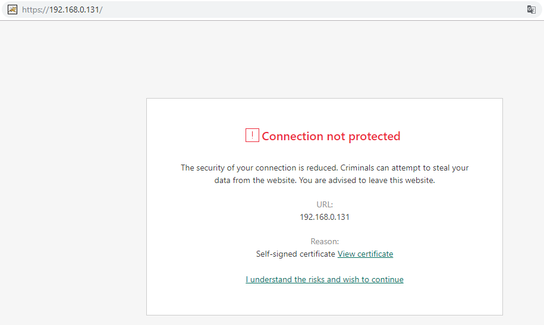

# Certificado SSL Auto Assinado para o Apache 2 no OEL 7.4+

[TOC]

## Criando usuário c/acesso a root

```bash
# link: https://www.digitalocean.com/community/tutorials/initial-server-setup-with-centos-7
adduser admin
# config senha
passwd admin
# colocando no grupo
gpasswd -a admin wheel
```

## Etapa 1: instalar o Apache e ajustar o firewall

### Ajustando os repositórios do Linux

```bash
# baixar a versao mais recente do repositorio do oracel
# wget http://public-yum.oracle.com/public-yum-ol7.repo
# renomear o repositorio existente
cp /etc/yum.repos.d/public-yum-ol7.repo /root/public-yum-ol7-old.repo
# copiar o repositorio baixado no diretorio correto
curl http://public-yum.oracle.com/public-yum-ol7.repo > /etc/yum.repos.d/public-yum-ol7.repo

#habilitando repos
sudo yum-config-manager --enable ol7_addons
sudo yum-config-manager --enable ol7_UEKR4
sudo yum-config-manager --enable ol7_MySQL57
sudo yum-config-manager --enable ol7_optional_latest

sudo yum-config-manager --enable ol7_developer_EPEL
sudo yum-config-manager --save --setopt=ol7_developer_EPEL.skip_if_unavailable=true
# instalando EPEL (pacotes extras para o Enterprise Linux)
sudo yum -y install https://dl.fedoraproject.org/pub/epel/epel-release-latest-7.noarch.rpm
```

### Instalando o Apache 2

```bash
# instalar o Nginx
sudo yum -y install httpd httpd-devel apr-devel mod_ssl
#permite que você possa executar scripts em PHP com as permissões de seus respectivos proprietários
#yum -y install mod_fcgid
#ativar o serviço
sudo systemctl enable httpd.service
sudo chkconfig httpd on
# Inicie o serviço
#sudo apachectl start
sudo service httpd start
# Verifique se o serviço está funcionando
systemctl status httpd

#configurar o firewall
sudo firewall-cmd --add-service=http
sudo firewall-cmd --add-service=https
sudo firewall-cmd --zone=zone --add-port=80/tcp
sudo firewall-cmd --permanent --zone=zone --add-port=80/tcp
sudo firewall-cmd --runtime-to-permanent
# Para firewall iptables em execução
sudo iptables -I INPUT -p tcp -m tcp --dport 80 -j ACCEPT
sudo iptables -I INPUT -p tcp -m tcp --dport 443 -j ACCEPT
```

Configurar o Apache:

```bash
# criar a variavel
arquivo_conf="/etc/httpd/conf.d/ssl.conf"

# DocumentRoot "/var/www/html" to DocumentRoot "/sites/www/principal"
sed -i "s/DocumentRoot \"\/var\/www\/html\"/DocumentRoot \"\/sites\/www\/principal\"/g" ${arquivo_conf}

# <Directory "/var/www"> to <Directory "/sites/www">
sed -i "s/Directory \"\/var\/www\"/Directory \"\/sites\/www\"/g" ${arquivo_conf}

# <Directory "/var/www/html"> to <Directory "/sites/www/principal">
sed -i "s/Directory \"\/var\/www\/html\"/Directory \"\/sites\/www\/principal\"/g" ${arquivo_conf}
```

## Etapa 2: Criar o certificado SSL

O TLS / SSL funciona usando uma combinação de um certificado público e uma chave privada. A chave SSL é mantida em segredo no servidor. Ele é usado para criptografar o conteúdo enviado aos clientes. O certificado SSL é compartilhado publicamente com qualquer pessoa que solicite o conteúdo. Ele pode ser usado para descriptografar o conteúdo assinado pela chave SSL associada.

O diretório `/etc/ssl/certs`, que pode ser usado para conter o certificado público, já deve existir no servidor. Vamos criar também um `/etc/ssl/private`diretório para manter o arquivo da chave privada. Como o sigilo dessa chave é essencial para a segurança, bloquearemos as permissões para impedir o acesso não autorizado:

```bash
sudo mkdir /etc/ssl/private
sudo chmod 700 /etc/ssl/private
```

Agora, podemos criar um par de chaves e certificados **autoassinados** com o **OpenSSL** em um único comando, digitando:

```bash
sudo openssl req -x509 -nodes -days 365 -newkey rsa:2048 -keyout /etc/ssl/private/nginx-selfsigned.key -out /etc/ssl/certs/nginx-selfsigned.crt
```

Você será solicitado uma série de perguntas. Antes de passarmos por isso, vamos dar uma olhada no que está acontecendo no comando que estamos emitindo:

- **openssl** : Esta é a ferramenta básica de linha de comando para criar e gerenciar certificados OpenSSL, chaves e outros arquivos.
- **req** : Este subcomando especifica que queremos usar o gerenciamento de solicitação de assinatura de certificado X.509 (CSR). O "X.509" é um padrão de infra-estrutura de chave pública ao qual o SSL e o TLS aderem para seu gerenciamento de chaves e certificados. Queremos criar um novo certificado X.509, por isso estamos usando este subcomando.
- **-x509** : Isso modifica ainda mais o subcomando anterior, informando ao utilitário que queremos criar um certificado autoassinado em vez de gerar uma solicitação de assinatura de certificado, como normalmente aconteceria.
- **-nodes** : Isso diz ao OpenSSL para pular a opção para proteger nosso certificado com uma frase secreta. Precisamos que o Nginx possa ler o arquivo, sem intervenção do usuário, quando o servidor for inicializado. Uma frase secreta impediria que isso acontecesse, porque teríamos que inseri-la após cada reinicialização.
- **-days 365** : Essa opção define o período de tempo em que o certificado será considerado válido. Nós configuramos isso por um ano aqui.
- **-newkey rsa: 2048** : Isso especifica que queremos gerar um novo certificado e uma nova chave ao mesmo tempo. Não criamos a chave necessária para assinar o certificado em uma etapa anterior, portanto, precisamos criá-lo junto com o certificado. A `rsa:2048`parte diz para fazer uma chave RSA com 2048 bits de comprimento.
- **-keyout** : Esta linha informa ao OpenSSL onde colocar o arquivo de chave privada gerado que estamos criando.
- **-out** : Isso informa ao OpenSSL onde colocar o certificado que estamos criando.

Essas opções criarão um arquivo de chave e um certificado. Serão feitas algumas perguntas sobre o nosso servidor, a fim de incorporar as informações corretamente no certificado.

Preencha os prompts adequadamente. **A linha mais importante é aquela que solicita o Common Name (e.g. server FQDN or YOUR name). Você precisa inserir o nome de domínio associado ao seu servidor ou ao endereço IP público do seu servidor.**

A totalidade dos prompts será algo parecido com isto:

```bash
#Output
Country Name (2 letter code) [XX]:BR
State or Province Name (full name) []:Rio de Janeiro
Locality Name (eg, city) [Default City]:Cidade do Rio de Janeiro
Organization Name (eg, company) [Default Company Ltd]:Marinha do Brasil
Organizational Unit Name (eg, section) []:DAbM-60 - Depto de TI
Common Name (eg, your name or your server's hostname) []:192.168.0.131
Email Address []:dabm.sistemas@marinha.mil.br
```

Ambos os arquivos que você criou serão colocados nos subdiretórios apropriados do diretório `/etc/ssl`.

Enquanto estivermos usando o OpenSSL, devemos também criar um grupo Diffie-Hellman forte, que é usado na negociação do [Perfect Forward Secrecy](https://en.wikipedia.org/wiki/Forward_secrecy) com clientes.

```bash
sudo openssl dhparam -out /etc/ssl/certs/dhparam.pem 2048
```

Isso pode levar alguns minutos, mas quando estiver pronto, você terá um forte grupo DH `/etc/ssl/certs/dhparam.pem`que podemos usar em nossa configuração.

Como a versão do Apache que acompanha o OEL 7.4+ não inclui a diretiva `SSLOpenSSLConfCmd`, teremos que anexar manualmente o arquivo gerado ao final do nosso certificado autoassinado. Para fazer isso, digite:

```bash
cat /etc/ssl/certs/dhparam.pem | sudo tee -a /etc/ssl/certs/apache-selfsigned.crt
```

O arquivo `apache-selfsigned.crt` agora deve ter o certificado e o grupo Diffie-Hellman gerado.

## Etapa 3: Configurar o Certificado

Abra o arquivo de configuração SSL do Apache em seu editor de texto com privilégios de **root**:

Abra um arquivo chamado `ssl.conf`no diretório `/etc/httpd/conf.d`:

```bash
sudo vim /etc/httpd/conf.d/ssl.conf
```

Encontre a seção que começa com `<VirtualHost _default_:443>`. Precisamos fazer algumas alterações aqui para garantir que nosso certificado SSL seja aplicado corretamente ao nosso site.

### Ajustando as diretivas VirtualHost

Primeiro, remova o comentário da `DocumentRoot`linha e edite o endereço entre aspas na localização da raiz de documentos do seu site. Por padrão, isso estará dentro `/var/www/html`, e você não precisa alterar esta linha se você não alterou a raiz do documento para o seu site. No entanto, se você seguiu um guia como nosso [guia de instalação de hosts virtuais Apache](https://www.digitalocean.com/community/tutorials/how-to-set-up-apache-virtual-hosts-on-centos-7) , a raiz de documentos do seu site pode ser diferente.

Em seguida, remova o comentário da linha `ServerName` e substitua `www.example.com` pelo seu **nome de domínio ou endereço IP do servidor** (o que você colocar como nome comum em seu certificado):

```nginx
<VirtualHost _default_:443>
. . .
DocumentRoot "/var/www/example.com/public_html"
ServerName www.example.com:443
```

ou execute o scripit abaixo:

```bash
arquivo_conf="/etc/httpd/conf.d/ssl.conf"

#DocumentRoot "/var/www/html"
sed -i "s/#DocumentRoot \"\/var\/www\/html\"/DocumentRoot \"\/sites\/www\/principal\/g" ${arquivo_conf}

#ServerName www.example.com:443
sed -i "s/#ServerName www.example.com:443/#ServerName 192.168.0.131:443/g" ${arquivo_conf}
```

Em seguida, encontre as linhas referentes as diretivas `SSLProtocol` e `SSLCipherSuite` excluindo ou comentando a referidas linhas. A configuração que estaremos executando oferecerá configurações mais seguras do que o padrão incluído no Apache do Oracle Linux 7.4:

`/etc/httpd/conf.d/ssl.conf`

```nginx
. . .
# SSLProtocol all -SSLv2
. . .
# SSLCipherSuite HIGH:MEDIUM:!aNULL:!MD5:!SEED:!IDEA
```

Encontre as linhas `SSLCertificateFile` e `SSLCertificateKeyFile ` e modifique para o diretório que fizemos no `/etc/httpd/ssl`:

```nginx
# dentro do bloco/tag VirtualHost
<VirtualHost _default_:443>
...
SSLCertificateFile /etc/ssl/certs/apache-selfsigned.crt
SSLCertificateKeyFile /etc/ssl/private/apache-selfsigned.key
...
</VirtualHost>
```

As próximas alterações ocorrerão após a tag `</VirtualHost>` final dentro desse mesmo arquivo.

### Configurando Parâmetros SSL Seguros

Em seguida, para configurar o Apache SSL com mais segurança, usaremos as recomendações de [Remy van Elst](https://raymii.org/s/static/About.html) no site [Cipherli.st](https://cipherli.st/) . Este site foi projetado para fornecer configurações de criptografia fáceis de consumir para softwares populares. Você pode ler mais sobre suas decisões sobre as escolhas do Apache [aqui](https://raymii.org/s/tutorials/Strong_SSL_Security_On_Apache2.html) .

A outra mudança que faremos é comentar a diretiva `SSLSessionTickets`, já que ela não está disponível na versão do Apache fornecida com o CentOS 7.

Cole nas configurações do site **após** o bloco final do `VirtualHost`:

```nginx
...
</VirtualHost>
                             
# Begin copied text
# from https://cipherli.st/
# and https://raymii.org/s/tutorials/Strong_SSL_Security_On_Apache2.html

SSLCipherSuite EECDH+AESGCM:EDH+AESGCM:AES256+EECDH:AES256+EDH
SSLProtocol All -SSLv2 -SSLv3
SSLHonorCipherOrder On
# Disable preloading HSTS for now.  You can use the commented out header line that includes
# the "preload" directive if you understand the implications.
#Header always set Strict-Transport-Security "max-age=63072000; includeSubdomains; preload"
Header always set Strict-Transport-Security "max-age=63072000; includeSubdomains"
Header always set X-Frame-Options DENY
Header always set X-Content-Type-Options nosniff
# Requires Apache >= 2.4
SSLCompression off 
SSLUseStapling on 
SSLStaplingCache "shmcb:logs/stapling-cache(150000)" 
# Requires Apache >= 2.4.11
# SSLSessionTickets Off
```

### (Recomendado) Modifique o arquivo do host virtual não criptografado para redirecionar para HTTPS

Atualmente, o servidor fornecerá tráfego HTTP não criptografado e HTTPS criptografado. Para melhor segurança, recomenda-se, na maioria dos casos, **redirecionar HTTP para HTTPS automaticamente**. Se você não quiser ou precisar dessa funcionalidade, poderá pular esta seção com segurança.

Para redirecionar todo o tráfego para ser SSL criptografado, criar e abrir um arquivo terminando em `.conf` no diretório `/etc/httpd/conf.d`:

```bash
sudo vim /etc/httpd/conf.d/non-ssl.conf
```

No interior, crie um bloco `VirtualHost` para corresponder às solicitações na porta 80. No interior, use a  diretiva `ServerName` para corresponder novamente ao seu **nome de domínio ou endereço IP**. Em seguida, use a diretiva `Redirect` para corresponder a quaisquer solicitações e enviá-las para o SSL `VirtualHost`. Certifique-se de incluir a barra final:

```nginx
<VirtualHost *:80>
        ServerName www.example.com
        Redirect "/" "https://www.example.com/"
</VirtualHost>

# exemplo de uso
<VirtualHost *:80>
        ServerName 192.168.0.131
        Redirect "/" "https://192.168.0.131/"
</VirtualHost>
```

Salve e feche este arquivo quando terminar.

## Etapa 4: Ativar o Certificado

Até agora, você criou um certificado SSL e configurou seu servidor da Web para aplicá-lo ao seu site. Para aplicar todas essas mudanças e começar a usar sua criptografia SSL, você pode **reiniciar o servidor Apache** para recarregar suas configurações e módulos.

Primeiro, verifique seu arquivo de configuração para erros de sintaxe digitando:

```bash
sudo apachectl configtest
```

Enquanto a saída terminar `Syntax OK`, você estará seguro para continuar. Se isso não fizer parte da sua saída, verifique a sintaxe de seus arquivos e tente novamente:

Reinicie o servidor Apache para aplicar suas alterações digitando:

 `sudo systemctl restart httpd.service`

Em seguida, verifique se as portas 80 e 443 estão abertas no seu firewall. Se você não estiver executando um firewall, poderá avançar.

Se você tiver um **firewall** firewalld em execução, poderá abrir essas portas digitando:

```bash
sudo firewall-cmd --add-service=http
sudo firewall-cmd --add-service=https
sudo firewall-cmd --runtime-to-permanent
```

Se houver um firewall **iptables em** execução, os comandos que você precisa executar dependem muito do seu conjunto de regras atual. Para um conjunto de regras básicas, você pode adicionar acesso HTTP e HTTPS digitando:

```bash
sudo iptables -I INPUT -p tcp -m tcp --dport 80 -j ACCEPT
sudo iptables -I INPUT -p tcp -m tcp --dport 443 -j ACCEPT
```

Em seu navegador da Web, tente visitar seu nome de domínio ou IP `https://` para ver seu novo certificado em ação.

Seu navegador provavelmente avisará que o certificado de segurança do site não é confiável. Como o certificado não está assinado por uma autoridade de certificação na qual o navegador confie, o navegador não pode verificar a identidade do servidor ao qual você está tentando se conectar. **Criamos um certificado auto-assinado em vez de um certificado assinado por uma CA confiável**, portanto, isso faz todo o sentido.

Depois de adicionar uma exceção à verificação de identidade do navegador, você poderá prosseguir para o site recém-protegido.



## Conclusão

Você configurou seu servidor Apache para lidar com solicitações HTTP e HTTPS. Isso ajudará você a se comunicar com os clientes de maneira segura e evitar que partes externas possam ler seu tráfego.

Se você estiver planejando usar SSL em um site público, provavelmente comprará um certificado SSL de uma autoridade de certificação confiável para evitar que os avisos assustadores sejam exibidos para cada um de seus visitantes.

Existe também uma forma de **certificado SSL grátis** da certificadora [Let’s Encrypt](https://letsencrypt.org/) .

## Referências

- https://www.digitalocean.com/community/tutorials/how-to-create-an-ssl-certificate-on-apache-for-centos-7
- https://www.secnet.com.br/blog/instalar-certificado-ssl-gratuito-no-apache-centos-7