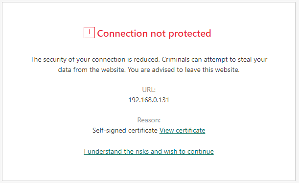
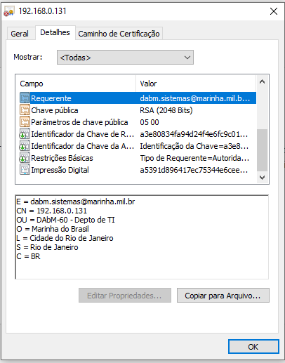
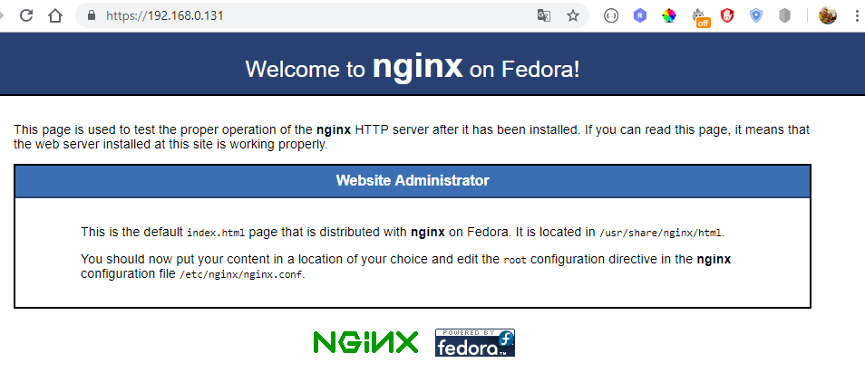

# Certificado SSL Auto Assinado para o Nginx no OEL 7.4+

[TOC]

## Criando usuário c/acesso a root

```bash
# link: https://www.digitalocean.com/community/tutorials/initial-server-setup-with-centos-7
adduser admin
# config senha
passwd admin
# colocando no grupo
gpasswd -a admin wheel
```

## Etapa 1: instalar o Nginx e ajustar o firewall

### Ajustando os repositórios do Linux

```bash
# baixar a versao mais recente do repositorio do oracel
# wget http://public-yum.oracle.com/public-yum-ol7.repo
# renomear o repositorio existente
cp /etc/yum.repos.d/public-yum-ol7.repo /root/public-yum-ol7-old.repo
# copiar o repositorio baixado no diretorio correto
curl http://public-yum.oracle.com/public-yum-ol7.repo > /etc/yum.repos.d/public-yum-ol7.repo

#habilitando repos
sudo yum-config-manager --enable ol7_addons
sudo yum-config-manager --enable ol7_UEKR4
sudo yum-config-manager --enable ol7_MySQL57
sudo yum-config-manager --enable ol7_optional_latest

sudo yum-config-manager --enable ol7_developer_EPEL
sudo yum-config-manager --save --setopt=ol7_developer_EPEL.skip_if_unavailable=true
# instalando EPEL (pacotes extras para o Enterprise Linux)
sudo yum -y install https://dl.fedoraproject.org/pub/epel/epel-release-latest-7.noarch.rpm
```

### Instalando o Nginx

```bash
# instalar o Nginx
sudo yum -y install nginx
# Inicie o serviço Nginx
sudo systemctl start nginx
# Verifique se o serviço está funcionando
systemctl status nginx
#ativar o Nginx
sudo systemctl enable nginx
#configurar o firewall
sudo firewall-cmd --add-service=http
sudo firewall-cmd --add-service=https
sudo firewall-cmd --runtime-to-permanent
# Para firewall iptables em execução
sudo iptables -I INPUT -p tcp -m tcp --dport 80 -j ACCEPT
sudo iptables -I INPUT -p tcp -m tcp --dport 443 -j ACCEPT
```

## Etapa 2: Criar o certificado SSL

O TLS / SSL funciona usando uma combinação de um certificado público e uma chave privada. A chave SSL é mantida em segredo no servidor. Ele é usado para criptografar o conteúdo enviado aos clientes. O certificado SSL é compartilhado publicamente com qualquer pessoa que solicite o conteúdo. Ele pode ser usado para descriptografar o conteúdo assinado pela chave SSL associada.

O diretório `/etc/ssl/certs`, que pode ser usado para conter o certificado público, já deve existir no servidor. Vamos criar também um `/etc/ssl/private`diretório para manter o arquivo da chave privada. Como o sigilo dessa chave é essencial para a segurança, bloquearemos as permissões para impedir o acesso não autorizado:

```bash
sudo mkdir /etc/ssl/private
sudo chmod 700 /etc/ssl/private
```

Agora, podemos criar um par de chaves e certificados **autoassinados** com o **OpenSSL** em um único comando, digitando:

```bash
sudo openssl req -x509 -nodes -days 365 -newkey rsa:2048 -keyout /etc/ssl/private/nginx-selfsigned.key -out /etc/ssl/certs/nginx-selfsigned.crt
```

Você será solicitado uma série de perguntas. Antes de passarmos por isso, vamos dar uma olhada no que está acontecendo no comando que estamos emitindo:

- **openssl** : Esta é a ferramenta básica de linha de comando para criar e gerenciar certificados OpenSSL, chaves e outros arquivos.
- **req** : Este subcomando especifica que queremos usar o gerenciamento de solicitação de assinatura de certificado X.509 (CSR). O "X.509" é um padrão de infra-estrutura de chave pública ao qual o SSL e o TLS aderem para seu gerenciamento de chaves e certificados. Queremos criar um novo certificado X.509, por isso estamos usando este subcomando.
- **-x509** : Isso modifica ainda mais o subcomando anterior, informando ao utilitário que queremos criar um certificado autoassinado em vez de gerar uma solicitação de assinatura de certificado, como normalmente aconteceria.
- **-nodes** : Isso diz ao OpenSSL para pular a opção para proteger nosso certificado com uma frase secreta. Precisamos que o Nginx possa ler o arquivo, sem intervenção do usuário, quando o servidor for inicializado. Uma frase secreta impediria que isso acontecesse, porque teríamos que inseri-la após cada reinicialização.
- **-days 365** : Essa opção define o período de tempo em que o certificado será considerado válido. Nós configuramos isso por um ano aqui.
- **-newkey rsa: 2048** : Isso especifica que queremos gerar um novo certificado e uma nova chave ao mesmo tempo. Não criamos a chave necessária para assinar o certificado em uma etapa anterior, portanto, precisamos criá-lo junto com o certificado. A `rsa:2048`parte diz para fazer uma chave RSA com 2048 bits de comprimento.
- **-keyout** : Esta linha informa ao OpenSSL onde colocar o arquivo de chave privada gerado que estamos criando.
- **-out** : Isso informa ao OpenSSL onde colocar o certificado que estamos criando.

Essas opções criarão um arquivo de chave e um certificado. Serão feitas algumas perguntas sobre o nosso servidor, a fim de incorporar as informações corretamente no certificado.

Preencha os prompts adequadamente. **A linha mais importante é aquela que solicita o Common Name (e.g. server FQDN or YOUR name). Você precisa inserir o nome de domínio associado ao seu servidor ou ao endereço IP público do seu servidor.**

A totalidade dos prompts será algo parecido com isto:

```bash
#Output
Country Name (2 letter code) [XX]:BR
State or Province Name (full name) []:Rio de Janeiro
Locality Name (eg, city) [Default City]:Cidade do Rio de Janeiro
Organization Name (eg, company) [Default Company Ltd]:Marinha do Brasil
Organizational Unit Name (eg, section) []:DAbM-60 - Depto de TI
Common Name (eg, your name or your server's hostname) []:192.168.0.131
Email Address []:dabm.sistemas@marinha.mil.br
```

Ambos os arquivos que você criou serão colocados nos subdiretórios apropriados do diretório `/etc/ssl`.

Enquanto estivermos usando o OpenSSL, devemos também criar um grupo Diffie-Hellman forte, que é usado na negociação do [Perfect Forward Secrecy](https://en.wikipedia.org/wiki/Forward_secrecy) com clientes.

```bash
sudo openssl dhparam -out /etc/ssl/certs/dhparam.pem 2048
```

Isso pode levar alguns minutos, mas quando estiver pronto, você terá um forte grupo DH `/etc/ssl/certs/dhparam.pem`que podemos usar em nossa configuração.

## Etapa 3: Configurar o Nginx para usar o SSL

A configuração padrão do Nginx no OEL 7 é bastante desestruturada, com o bloco do servidor HTTP padrão dentro do arquivo de configuração principal. Nginx irá verificar se há arquivos terminando em `.conf`no `/etc/nginx/conf.d`diretório para configuração adicional.

Vamos criar um novo arquivo neste diretório para configurar um bloco de servidor que serve conteúdo usando os arquivos de certificado que geramos. Podemos, então, opcionalmente, configurar o bloco de servidor padrão para redirecionar solicitações HTTP para HTTPS.

### Crie o bloco de servidor TLS / SSL

Crie e abra um arquivo chamado `ssl.conf`no diretório `/etc/nginx/conf.d`:

```bash
sudo vim /etc/nginx/conf.d/ssl.conf
```

Dentro, comece abrindo o bloco `server`. Por padrão, as conexões **TLS / SSL** usam a **porta 443**, portanto essa deve ser nossa porta `listen`. O `server_name`deve ser definido para o **nome de domínio ou endereço IP do servidor** que você usou no *Common Name* ao gerar seu certificado. Em seguida, use as diretivas `ssl_certificate`, `ssl_certificate_key`e `ssl_dhparam` para definir o local dos arquivos SSL geramos:

#### /etc/nginx/conf.d/ssl.conf

```nginx
server {
    listen 443 http2 ssl;
    listen [::]:443 http2 ssl;

    server_name server_IP_address;

    ssl_certificate /etc/ssl/certs/nginx-selfsigned.crt;
    ssl_certificate_key /etc/ssl/private/nginx-selfsigned.key;
    ssl_dhparam /etc/ssl/certs/dhparam.pem;
}
```

Em seguida, adicionaremos algumas opções SSL adicionais que aumentarão a segurança do nosso site. As opções que usaremos são recomendações de [Remy van Elst](https://raymii.org/s/static/About.html) no site da [Cipherli.st](https://cipherli.st/) . Este site foi projetado para fornecer configurações de criptografia fáceis de consumir para softwares populares. Você pode aprender mais sobre as decisões dele em relação às opções do Nginx, lendo [Strong SSL Security no nginx](https://raymii.org/s/tutorials/Strong_SSL_Security_On_nginx.html).

> **Nota:** As configurações sugeridas padrão no [Cipherli.st](https://cipherli.st/) oferecem segurança forte. Às vezes, isso ocorre ao custo de maior compatibilidade com o cliente. Se você precisar oferecer suporte a clientes mais antigos, há uma lista alternativa que pode ser acessada clicando no link "Sim, me dê um ciphersuite que funcione com software legado / antigo".
>
> A lista de compatibilidade pode ser usada em vez das sugestões padrão na configuração acima entre os dois blocos de comentário. A escolha de qual configuração você usará dependerá em grande parte do que você precisa suportar.

Existem algumas partes da configuração que você pode querer modificar. Primeiro, você pode adicionar seu resolvedor DNS preferencial para solicitações upstream à `resolver`diretiva. Usamos o Google para este guia, mas você pode mudar isso se tiver outras preferências.

Finalmente, você deve [reservar](https://en.wikipedia.org/wiki/HTTP_Strict_Transport_Security) um momento para ler sobre [HTTP Strict Transport Security, ou HSTS](https://en.wikipedia.org/wiki/HTTP_Strict_Transport_Security) , e especificamente sobre a [funcionalidade "pré-carregamento"](https://hstspreload.appspot.com/) . O pré-carregamento de HSTS fornece maior segurança, mas pode ter conseqüências de longo alcance se for habilitado ou habilitado acidentalmente incorretamente. Neste guia, não pré-carregaremos as configurações, mas você poderá modificá-las se tiver certeza de que compreende as implicações.

#### /etc/nginx/conf.d/ssl.conf

```nginx
server {
    listen 443 http2 ssl;
    listen [::]:443 http2 ssl;

    server_name server_IP_address;

    ssl_certificate /etc/ssl/certs/nginx-selfsigned.crt;
    ssl_certificate_key /etc/ssl/private/nginx-selfsigned.key;
    ssl_dhparam /etc/ssl/certs/dhparam.pem;

    ########################################################################
    # from https://cipherli.st/                                            #
    # and https://raymii.org/s/tutorials/Strong_SSL_Security_On_nginx.html #
    ########################################################################

    ssl_protocols TLSv1 TLSv1.1 TLSv1.2;
    ssl_prefer_server_ciphers on;
    ssl_ciphers "EECDH+AESGCM:EDH+AESGCM:AES256+EECDH:AES256+EDH";
    ssl_ecdh_curve secp384r1;
    ssl_session_cache shared:SSL:10m;
    ssl_session_tickets off;
    ssl_stapling on;
    ssl_stapling_verify on;
    resolver 8.8.8.8 8.8.4.4 valid=300s;
    resolver_timeout 5s;
    # Disable preloading HSTS for now.  You can use the commented out header line that includes
    # the "preload" directive if you understand the implications.
    #add_header Strict-Transport-Security "max-age=63072000; includeSubdomains; preload";
    add_header Strict-Transport-Security "max-age=63072000; includeSubdomains";
    add_header X-Frame-Options DENY;
    add_header X-Content-Type-Options nosniff;

    ##################################
    # END https://cipherli.st/ BLOCK #
    ##################################
}
```

Como estamos usando um certificado autoassinado, o grampeamento SSL não será usado. O Nginx simplesmente emitirá um aviso, desativará o grampeamento do nosso certificado autoassinado e continuará operando corretamente.

Por fim, adicione o restante da configuração do Nginx ao seu site. Isso será diferente dependendo das suas necessidades. Vamos apenas copiar algumas das diretivas usadas no bloco de localização padrão para o nosso exemplo, que irá definir a raiz do documento e algumas páginas de erro:

#### /etc/nginx/conf.d/ssl.conf

```nginx
server {
    listen 443 http2 ssl;
    listen [::]:443 http2 ssl;

    server_name server_IP_address;

    ssl_certificate /etc/ssl/certs/nginx-selfsigned.crt;
    ssl_certificate_key /etc/ssl/private/nginx-selfsigned.key;
    ssl_dhparam /etc/ssl/certs/dhparam.pem;

    ########################################################################
    # from https://cipherli.st/                                            #
    # and https://raymii.org/s/tutorials/Strong_SSL_Security_On_nginx.html #
    ########################################################################

    . . .

    ##################################
    # END https://cipherli.st/ BLOCK #
    ##################################

    root /usr/share/nginx/html;

    location / {
    }

    error_page 404 /404.html;
    location = /404.html {
    }

    error_page 500 502 503 504 /50x.html;
    location = /50x.html {
    }
}
```

Quando terminar, salve e saia. Isso configura o Nginx para usar nosso certificado SSL gerado para criptografar o tráfego. As opções SSL especificadas garantem que apenas os protocolos e cifras mais seguros sejam usados. Observe que essa configuração de exemplo simplesmente exibe a página Nginx padrão, portanto, convém modificá-la para atender às suas necessidades.

### (Opcional) Criar um redirecionamento de HTTP para HTTPS

Com a nossa configuração atual, o Nginx responde com conteúdo criptografado para solicitações na porta 443, mas responde com conteúdo não criptografado para solicitações na porta 80. Isso significa que nosso site oferece criptografia, mas não impõe seu uso. Isso pode ser bom para alguns casos de uso, mas geralmente é melhor exigir criptografia. Isso é especialmente importante quando dados confidenciais, como senhas, podem ser transferidos entre o navegador e o servidor.

Felizmente, o arquivo de configuração padrão do Nginx nos permite adicionar facilmente diretivas ao bloco de servidor padrão da porta 80, adicionando arquivos no  diretório `/etc/nginx/default.d`. Crie um novo arquivo chamado `ssl-redirect.conf`e abra-o para edição com este comando:

```bash
sudo vim /etc/nginx/default.d/ssl-redirect.conf
```

Em seguida, cole no arquivo: `/etc/nginx/default.d/ssl-redirect.conf`

```bash
return 301 https://$host$request_uri/;
```
ou:

```bash
sudo touch /etc/nginx/default.d/ssl-redirect.conf
sudo echo 'return 301 https://$host$request_uri/;' >> /etc/nginx/default.d/ssl-redirect.conf
```

Salve e feche o arquivo quando terminar. Isso configura o HTTP no bloco de servidor da porta 80 (padrão) para redirecionar as solicitações recebidas para o bloco do servidor HTTPS que configuramos.

## Etapa 4: ativar as alterações no Nginx

Agora que fizemos nossas alterações, podemos reiniciar o Nginx para implementar nossa nova configuração.

Primeiro, devemos verificar se não há erros de sintaxe em nossos arquivos. Podemos fazer isso digitando:

```bash
sudo nginx -t
```

Se tudo for bem sucedido, você obterá um resultado assim:

```bash
# Output
nginx: [warn] "ssl_stapling" ignored, issuer certificate not found for certificate "/etc/ssl/certs/nginx-selfsigned.crt"
nginx: the configuration file /etc/nginx/nginx.conf syntax is ok
nginx: configuration file /etc/nginx/nginx.conf test is successful
```

Observe o aviso no começo. Conforme observado anteriormente, essa configuração específica gera um aviso, pois nosso certificado autoassinado não pode usar o grampeamento SSL. Isso é esperado e nosso servidor ainda pode criptografar as conexões corretamente.

Se sua saída corresponder ao acima, seu arquivo de configuração não terá erros de sintaxe. Podemos reiniciar o Nginx com segurança para implementar nossas alterações:

```bash
sudo systemctl restart nginx
```

O processo Nginx será reiniciado, implementando as configurações SSL que configuramos.

## Etapa 5: teste de criptografia

Agora estamos prontos para testar nosso servidor SSL.

Abra o seu navegador da Web e digite `https://`seguido pelo nome de domínio do seu servidor ou IP na barra de endereço:

```bash
# https://server_domain_or_IP
https://192.168.0.131/
```

Como o certificado que criamos não é assinado por uma das autoridades de certificação confiáveis do seu navegador, você provavelmente verá um aviso de aparência assustadora como o abaixo:



Isso é esperado e normal. Caso queria visualizar o certificado criado, basta acessar o link ***View certificate***:



Isso é esperado e normal. Clique em "AVANÇADO" e, em seguida, no link fornecido para continuar com o seu host:



Você deve ser levado ao seu site. Se você olhar na barra de endereços do navegador, verá alguma indicação de segurança parcial. Isso pode ser um bloqueio com um "x" sobre ele ou um triângulo com um ponto de exclamação. Nesse caso, isso significa apenas que o certificado não pode ser validado. Ainda está criptografando sua conexão.

Se você configurou o Nginx para redirecionar solicitações HTTP para HTTPS, você também pode verificar se o redirecionamento funciona corretamente:

```bash
# https://server_domain_or_IP
http://192.168.0.131/
```

Se isso resultar no mesmo ícone, isso significa que o redirecionamento funcionou corretamente.

## Conclusão

Você configurou seu servidor Nginx para usar criptografia forte para conexões de clientes. Isso permitirá que você atenda a solicitações com segurança e impedirá que terceiros leiam seu tráfego.

## Referências

- https://www.digitalocean.com/community/tutorials/how-to-create-a-self-signed-ssl-certificate-for-nginx-on-centos-7