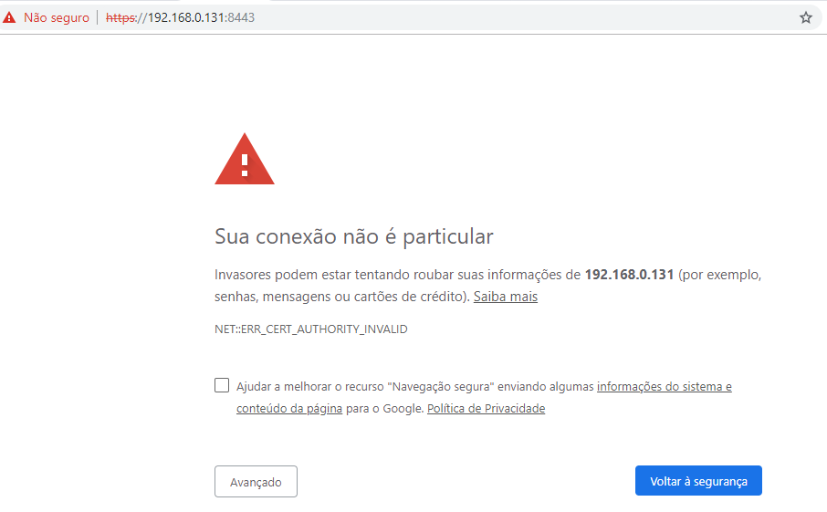
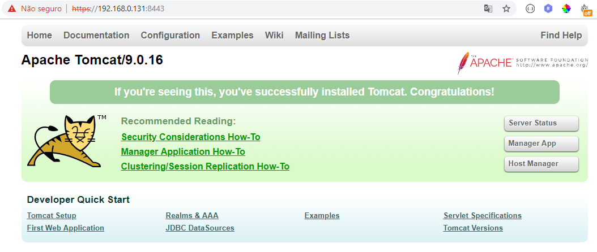

# Configurar o certificado SSL no Tomcat 9 no OEL 7+

## Introdução

Este tutorial parte do princípio de que já existe uma  instalação básica e algumas configurações da versão mais recente do **Tomcat 9** no seu servidor **Oracle Enterprise Linux 7.3+**. 

O Tomcat opera nos seguintes formatos de keystores `JKS`, `PKCS11` ou `PKCS12`. O formato `JKS` é o formato "Java KeyStore" padrão do Java e é o formato criado pelo utilitário de linha de comando `keytool`. Esta ferramenta está incluída no JDK. O formato `PKCS12` é um **padrão da internet** e pode ser manipulado via (entre outras coisas) o OpenSSL e o Key-Manager da Microsoft. Nós estaremos usando duas formas: ***KEYTOOL*** que vem junto com a instalação do ***JDK*** e o ***OpenSSL***.

#### Gerando o Certificado Auto-Assinado com keytool do java

```bash
# windows
%JAVA_HOME%\bin\keytool -genkey -alias tomcat -keyalg RSA -keystore C:\Java\apache-tomcat-9.0.16\keystore\tomcat -validity 3650

# linux
$JAVA_HOME/bin/keytool -genkeypair -alias tomcat -keyalg RSA -keysize 2048 -keystore keystore.jks -validity 3650

# exemplo
[22.03.2019] root@localhost ~/dabm 
$ $JAVA_HOME/bin/keytool -genkeypair -alias tomcat -keyalg RSA -keysize 2048 -keystore keystore.jks -validity 3650
Informe a senha da área de armazenamento de chaves: 123456  
Informe novamente a nova senha: 123456
Qual é o seu nome e o seu sobrenome?
  [Unknown]:  Carlos Anders
Qual é o nome da sua unidade organizacional?
  [Unknown]:  DAbM-60 - Tecnologia de Informação
Qual é o nome da sua empresa?
  [Unknown]:  Marinha do Brasil
Qual é o nome da sua Cidade ou Localidade?
  [Unknown]:  Rio de Janeiro
Qual é o nome do seu Estado ou Município?
  [Unknown]:  RJ
Quais são as duas letras do código do país desta unidade?
  [Unknown]:  BR
CN=Carlos Anders, OU=DAbM-60 - Tecnologia de Informação, O=Marinha do Brasil, L=Rio de Janeiro, ST=RJ, C=BR Está correto?
  [não]:  sim

Informar a senha da chave de <tomcat>
	(RETURN se for igual à senha da área do armazenamento de chaves): 123456  

Warning:
O armazenamento de chaves JKS usa um formato proprietário. É recomendada a migração para PKCS12, que é um formato de padrão industrial que usa "keytool -importkeystore -srckeystore keystore.jks -destkeystore keystore.jks -deststoretype pkcs12".
```

Este comando irá criar um novo arquivo, no diretório especificado no parâmetro `-keystore`, caso seja omitido este parâmetro será criado no diretório **home do usuário** sob o qual você o executa, chamado `.keystore`.

Você pode verificar os detalhes do certificado gerado usando o seguinte comando keytool. ***Digite a senha do keystore: 123456***

```bash
22.03.2019] root@localhost ~/dabm 
$ keytool -list -keystore keystore.jks
Informe a senha da área de armazenamento de chaves:  123456
Tipo de área de armazenamento de chaves: jks
Fornecedor da área de armazenamento de chaves: SUN

Sua área de armazenamento de chaves contém 1 entrada

tomcat, 22/03/2019, PrivateKeyEntry, 
Fingerprint (SHA1) do certificado: 78:65:D6:B2:81:98:DD:31:76:94:85:43:9A:BA:0A:EF:EA:E2:90:89

Warning:
O armazenamento de chaves JKS usa um formato proprietário. É recomendada a migração para PKCS12, que é um formato de padrão industrial que usa "keytool -importkeystore -srckeystore keystore.jks -destkeystore keystore.jks -deststoretype pkcs12".
```

#### Use o certificado no Tomcat 9

Edite o arquivo `[Tomcat Dir]->conf->server.xml` e adicione o connector SSL.

```xml
<Connector
           protocol="org.apache.coyote.http11.Http11NioProtocol"
           port="8443" maxThreads="200"
           scheme="https" secure="true" SSLEnabled="true"
           keystoreFile="/var/opt/tomcat/latest/keystore.jks"
           keystorePass="marinha"
	       keyAlias="tomcat"
           clientAuth="false" 
           sslProtocol="TLS"/>

<!-- ou para caso tenha feito o comando sem  -keystore-->
<!-- Define a SSL Coyote HTTP/1.1 Connector on port 8443 -->
<Connector
           protocol="org.apache.coyote.http11.Http11NioProtocol"
           port="8443" maxThreads="200"
           scheme="https" secure="true" SSLEnabled="true"
           keystoreFile="${user.home}/.keystore" keystorePass="changeit"
           clientAuth="false" sslProtocol="TLS"/>
<!-- ou -->
<!-- Define a HTTP/1.1 Connector on port 8443, JSSE NIO implementation -->
<Connector protocol="org.apache.coyote.http11.Http11NioProtocol"
           sslImplementationName="org.apache.tomcat.util.net.jsse.JSSEImplementation"
           port="8443" .../>

<!-- Define a HTTP/1.1 Connector on port 8443, JSSE NIO2 implementation -->
<Connector protocol="org.apache.coyote.http11.Http11Nio2Protocol"
           sslImplementationName="org.apache.tomcat.util.net.jsse.JSSEImplementation"
           port="8443" .../>
```

#### Para usar o Certifica no Tomcat 8

```xml
<Connector port="8443" protocol="org.apache.coyote.http11.Http11NioProtocol"
               maxThreads="150" SSLEnabled="true" scheme="https" secure="true"
               clientAuth="false" sslProtocol="TLS" 
               keystoreFile="keystore.jks" 
               keystorePass="123456"
               keyAlias="tomcat"
               />
```

Tela avisando que o certificado no foi validade por uma CA.


Tela do Tomcat com SSL na porta 8443


#### Redirecionando da porta 8080 do Tomcat para 8443 (Opcional - Boa prática)

Edite o arquivo `[Tomcat Dir]->conf->server.xml` e altere o conector 8080 conforme abaixo: 

```xml
<Connector port="8080" maxHttpHeaderSize="8192" protocol="HTTP/1.1"
               maxThreads="150" minSpareThreads="25" maxSpareThreads="75"
               enableLookups="false" redirectPort="8443" acceptCount="100"
               connectionTimeout="20000" disableUploadTimeout="true" />
```

Edite o arquivo `[Tomcat Dir]->conf->web.xml` e adicione o seguinte conteúdo ao final do arquivo, dentro da tag: `<web-app>` ao final do arquivo.

```xml
...
    <!-- added by Anders for automatic redirect from HTTP to HTTPS -->
    <security-constraint>
      <web-resource-collection>
        <web-resource-name>Entire Application</web-resource-name>
        <url-pattern>/*</url-pattern>
      </web-resource-collection>
      <user-data-constraint>
        <transport-guarantee>CONFIDENTIAL</transport-guarantee>
      </user-data-constraint>
    </security-constraint>
</web-app>
```

### Reiniciar o Tomcat 9 ou o 8

```bash
./bin/shutdown.sh
./bin/startup.sh
```

## Referências

- https://tomcat.apache.org/tomcat-9.0-doc/ssl-howto.html
- https://www.journaldev.com/160/steps-to-configure-ssl-on-tomcat-and-setup-auto-redirect-from-http-to-https
- https://examples.javacodegeeks.com/enterprise-java/tomcat/apache-tomcat-ssl-configuration-tutorial/
- https://code-adda.com/2018/06/how-to-enable-ssl-or-https-in-apache-tomcat-8/