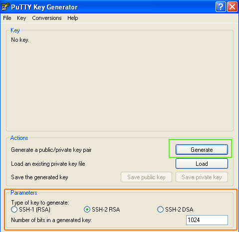
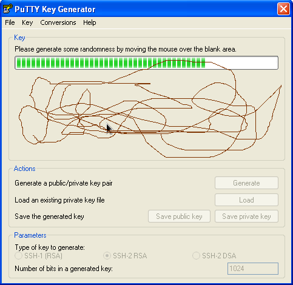
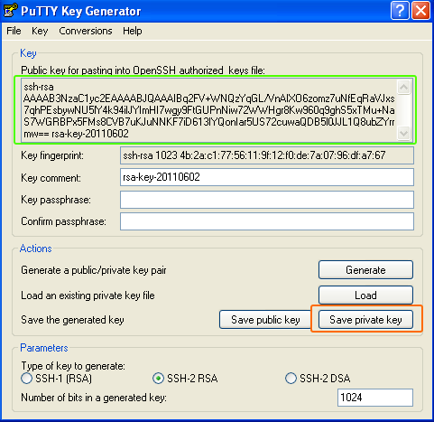
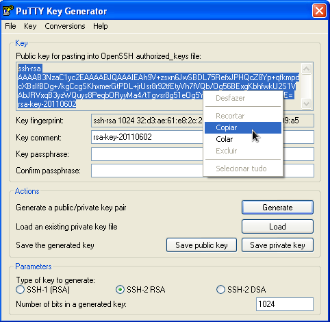
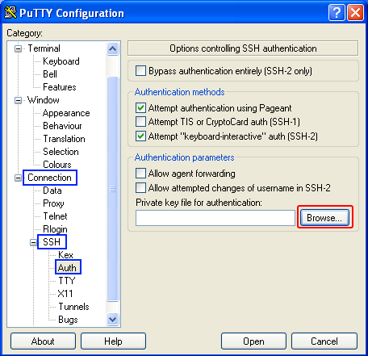
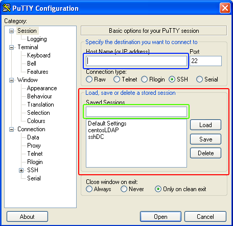

##  Instalar sshd no Oracle Linux e derivados 

> Autor: Carlos Anders

###  Verificando e instalando o serviço sshd 

  ```bash
# se estiver logado com o usuário root não será necessário usar o comando sudo

# Exemplo caso esteja logado com o root:
    # Verificar se o sshd está instalado
    systemctl sshd status
    # ou
    service sshd status

    # se o nao houver retorno
    yum install -y openssh-server

    # iniciar serviço
    systemctl sshd start
    # habilitar para quando reiniciar o servidor o serviço levantar
    chkconfig sshd on
    
# Exemplo caso esteja logado com um usuário normal:
    # Verificar se o sshd está instalado
    sudo systemctl sshd status
    # ou
    sudo service sshd status

    # se o nao houver retorno
    sudo yum install -y openssh-server

    # iniciar serviço
    sudo systemctl sshd start
    # habilitar para quando reiniciar o servidor o serviço levantar
    sudo chkconfig sshd on    
    
  ```

###  Testando o serviço sshd 

```bash
# testar o acesso
ssh nomeusuario@ip-remoto
```

###  Habilitando o root no terminal remoto 

```bash
# se estiver logado com o usuário root não será necessário usar o comando sudo

# editar o arquivo
sudo vim /etc/ssh/sshd_config
# ou pelo vi
sudo vi /etc/ssh/sshd_config
```
Já dentro do arquivo de configuração, edite as linhas indicadas abaixo: 

```bash
# se estiver logado com o usuário root não será necessário usar o comando sudo

# permite o acesso root ao servidor SSH
PermitRootLogin yes
# permite o acesso via chave pública
PubkeyAuthentication yes
# permite o acesso via senhas de texto
PasswordAuthentication yes

# ou
sudo sed -i '/PermitRootLogin/ s/.*/PermitRootLogin yes/g' /etc/ssh/sshd_config
sudo sed -i '/PubkeyAuthentication/ s/.*/PubkeyAuthentication yes/g' /etc/ssh/sshd_config
sudo sed -i '/PasswordAuthentication/ s/.*/PasswordAuthentication yes/g' /etc/ssh/sshd_config

#Reiniciar o serviço
sudo service ssh restart
```

### Colocando a chave pública no Servidor Linux pelo <u>shell</u>

- Passo 1 - Crie sua chave pública/privada no seu **computador** que deseja acessar o **Servidor**:

  Para criar no seu **computador**, o mesmo precisa ter um <u>terminal</u> (prompt de comando) que <u>aceite</u> comandos do <u>linux</u>, por exemplo, o shell do GIT - **[git-bash](https://gitforwindows.org/)** ou o **[Cmder](http://cmder.net/)**, excelentes opções para trabalhar com linha de comando no Windows para o Linux.

```bash
# Gerando a chave no shell que aceite comando linux, exemplo: git-bash ou Cmder
ssh-keygen -t rsa

# após os passos executados no comando acima, copie a sua chave pública
# geralmente ele cria nesta pasta no diretório do usuário logado no windows
# exemplo
C:\Users\anders
λ cat .ssh\id_rsa.pub
ssh-rsa AAAAB3NzaC1yc2EAAAADAQABAAABAQDQBbSVFDGwAJbcqZG9DZcKtuaNjwfhYfic8asgjsQV/jZCHjdawoCTc0FQe0F79eMSvl55KduWMykZocACe/VmkNq/0RynA8paPnCqi+4lyNRoWlKSsj38ABTmF2Lp+uuz2ZPLFIpPYcKdHOq68bX4amYF1SSQDxvGO9+T5+0j3l7JPmJSNU1e2p+Uz1mpWipY+JHNPH9vbCWbFp+tep2ya9rqgz/R3G5ybX/qefNB5EyGLBx4JPvtZYfsclkMSYnZj9/r0dAwxVggAZ/BkJjCWnjbmC/0ZKbvLUIHCBwX1TH1WSlqp+nJWd6XUuDbeEH8+nSCkU54uTFQVjTWQzTJ anders@marinha.mil.br

# ou
cat ~/.ssh/id_rsa.pub
```


- **Passo 2** - Enviando sua chave pública para o **Servidor Oracle Linux**:

  Caso **não** exista o usuário criado no seu Servidor para o qual você deseja conectar, **antes** será necessário **criá-lo** no **Servidor Oracle Linux**, conforme exemplo abaixo.


```bash
# se estiver logado com o usuário root não será necessário usar o comando sudo
  
# Criar o diretorio do home:
mkdir -p /home/novo_usuario
# criar o diretório .ssh dentro do home
mkdir -p /home/novo_usuario/.ssh
# Para criar usuário:
adduser --home /home/novo_usuario --shell /usr/bin/bash novo_usuario
# ou
adduser -d/home/novo_usuario -s/usr/bin/bash novo_usuario
adduser -d/home/novo_usuario --shell /usr/bin/bash novo_usuario
 
# Atribuindo uma senha para o usuário criado
passwd novo_usuario
```

  Acesse o **servidor** com ser **usuário e senha**, entre no diretório `.ssh`  pelo shell, do seu usuário criado na etapa anterior:

```bash
# os passos aqui executados são com o usuário criado e logado, 
# caso você esteja com o usuário root, troque e entre com seu usuário
# conforme exemplo
sudo su - novo_usuario

# vá para a pasta ssh
cd .ssh

# Crie ou edite o arquivo authorized_keys
touch authorized_keys

# cole a chave pública copiada no passo 1 no arquivo criado:
echo ssh-rsa AAAAB3NzaC1yc2EAAAADAQABAAABAQDQBbSVFDGwAJbcqZG9DZcKtuaNjwfhYfic8asgjsQV/jZCHjdawoCTc0FQe0F79eMSvl55KduWMykZocACe/VmkNq/0RynA8paPnCqi+4lyNRoWlKSsj38ABTmF2Lp+uuz2ZPLFIpPYcKdHOq68bX4amYF1SSQDxvGO9+T5+0j3l7JPmJSNU1e2p+Uz1mpWipY+JHNPH9vbCWbFp+tep2ya9rqgz/R3G5ybX/qefNB5EyGLBx4JPvtZYfsclkMSYnZj9/r0dAwxVggAZ/BkJjCWnjbmC/0ZKbvLUIHCBwX1TH1WSlqp+nJWd6XUuDbeEH8+nSCkU54uTFQVjTWQzTJ carlosanders@gmail.com >> authorized_keys
```

- **Passo 2.1** - <u>Opcionalmente</u>, se estiver em um **shell** que tenha e aceite comandos do Linux no seu **windows**, por exemplo**, git-bash ou Cmder**, digite o texto abaixo substituído o diretório pelo diretório que foi salvo a chave pública, gerada acima, assim não precisa acessar o Servidor e colar o arquivo, pois o script abaixo faz tudo isso direto do seu terminal.

  ```bash
  cat /path/dir/.ssh/sua-chave-publica.pub | ssh anders@192.168.0.109 "mkdir -p ~/.ssh && touch ~/.ssh/authorized_keys && chmod -R go= ~/.ssh && cat >> ~/.ssh/authorized_keys"
  ```

- **Passo 3** - Testando acesso no **Servidor Oracle Linux**:

  Basta acessar pelo próprio prompt de comando (shell) que automaticamente irá ser feito a conferência da chave privada localizada dentro da pasta `.ssh` do computador com a chave pública do servidor cadastrado no passo 2


```bash
#  caso a porta de acesso ao ssh seja diferente da padrão 22
ssh nomeusuario@ip-remoto -p numeroporta
```

### Colocando a chave pública no Servidor Linux pelo Putty Windows

- **Passo 1** - Instalar o **PuTTY** que vem com o **PuTTYGen** - site [PuTTY](https://www.chiark.greenend.org.uk/~sgtatham/putty/latest.html)

- **Passo 2** - Execute o programa. Você deverá ver a seguinte tela: 

  

  No ultimo painel (marcado com o retângulo **laranja**) você pode definir o tipo de chave e o tamanho da chave. Por padrão já vem selecionados os valores habituais.  O primeiro painel será usado para você movimentar o mouse e então a chave será gerada. 

- **Passo 3** - Para gerar a chave, clique no botão **Generate** (marcado com o retângulo verde na imagem acima).

- **Passo 4** -  Leve o ponteiro do mouse até o painel superior e faça movimentos aleatórios até que a barra de progresso seja completamente preenchida.

  

  Ao final do processo, deve aparecer uma tela semelhante a seguinte: 

  

- **Passo 5** -  Clique no botão Save private key (destacado com o retângulo laranja na imagem acima) para salvar o arquivo com sua chave privada. 

    - Em **“Key passphase”** e **“Confirm passphrase”**, digite uma senha conforme preferir. Este campo também pode ser deixado em branco, **mas** você terá menos segurança caso o faça, pois não existirá nenhum senha para acesso ao seu servidor.
    - Quando **terminar**, você vai precisar da **chave privada**, já que ela servirá para você autenticar seu computador ao servidor quando precisar fazer o acesso. Portanto, clique em **“Save private key”, sem fechar a janela, copie o texto que está no quadrado “Key”**, começando com **“ssh-rsa”**.

- **Passo 6** -  Selecione o texto na janela superior (marcada com retângulo verde) e **salve em um arquivo**. Ele será usado para liberar seu acesso a sua conta:



- **Passo 7** -  Proceda conforme os **Passos 2 ou 2.1**, conforme mencionado acima.

## Gravando a chave pública no PuTTY

- **Passo 8** -  Abra o PuTTY.

- **Passo 9** -  A esquerda, na configuração, em **Connection->SSH->Auth** temos o campo **Private key file for authentication**. Clique em **Browser** (destacado com retângulo  vermelho) e carregue o arquivo com sua chave privada.

  

- **Passo 10** - Agora volte no item **\*Session*** para informar os dados de conexão e salvar a sessão (área marcada com vermelho): 

  

  1.     Em **Host Name** (marcado com azul), preencha com o nome do servidor de acesso;
  2.     Em **\*Saved Session*** (marcado com verde), informe um nome para essa sessão;
  3.     Clique no botão **\*Save*** para salvar a sessão, assim você não precisará ficar informando o arquivo de chave privada toda vez que for conectar.
  

**Fonte (adaptado):**
http://www.dc.ufscar.br/suporte/nossa-rede/acesso-remoto/ssh-usando-putty
https://www.todoespacoonline.com/w/2015/08/configurando-ssh-keys-para-acesso-por-chave-publica/
